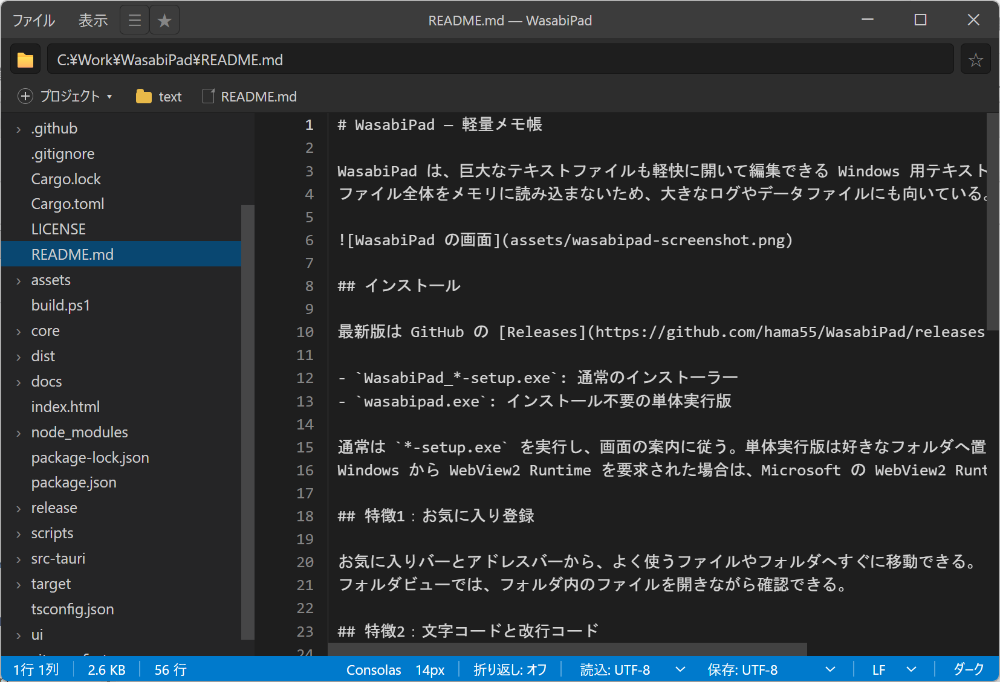

# WasabiPad — 軽量メモ帳

WasabiPad は、巨大なテキストファイルも軽快に開いて編集できる Windows 用テキストエディタ。
ファイル全体をメモリに読み込まないため、大きなログやデータファイルにも向いている。

## インストール

最新版は GitHub の [Releases](https://github.com/hama55/WasabiPad/releases) から取得する。

- `WasabiPad_*-setup.exe`: 通常のインストーラー
- `wasabipad.exe`: インストール不要の単体実行版

通常は `*-setup.exe` を実行し、画面の案内に従う。単体実行版は好きなフォルダへ置いて起動できる。
Windows から WebView2 Runtime を要求された場合は、Microsoft の WebView2 Runtime をインストールする。

## 特徴1：メモリ使用量を極限まで抑えたファイル読込み

WasabiPad は、必要な部分だけを読み込みながら表示・編集する。巨大なファイルでもメモリ使用量を抑えられる。4GBファイルも簡単に開く。

- 長い行の折り返し表示に対応
- 編集していない部分は、保存時にそのまま書き出す

注意:

- 開いている実ファイルは他のアプリから閲覧できるが、書き込み・削除・名前変更はできない
- UTF-16LE と空ファイルは通常のメモリ読込になる

## 特徴2：ファイルの素早い切替え

お気に入りバーとアドレスバーから、よく使うファイルやフォルダへすぐに移動できる。
フォルダビューでは、フォルダ内のファイルを開きながら確認できる。

## 特徴3：文字コードと改行コード

開くときは、BOM、UTF-8、Shift-JIS を自動判定する。UTF-16LE は BOM があるファイルに対応。

保存時はステータスバーから、文字コードと改行コードを選べる。

- UTF-8 / UTF-8 (BOM) / Shift-JIS / UTF-16LE
- CRLF / LF

## 特徴4：ZIP / Excel の閲覧

ZIP、xlsx、xls は読み取り専用で開ける。サイドバーから中身を展開し、選択した項目だけを表示するため、大きなアーカイブでも必要な内容だけ確認できる。

| 形式 | 表示内容 |
|---|---|
| ZIP / xlsx | 選択したファイルの内容。バイナリは `(バイナリ: N bytes)` と表示 |
| xls | 選択したシートをタブ区切りで表示 |

- フォルダ内の ZIP / xlsx / xls も同様に開ける
- 閲覧モードのため編集不可
- 暗号化 ZIP、4GB 超の ZIP64、BIFF5 以前の xls、Excel のセル書式には非対応
