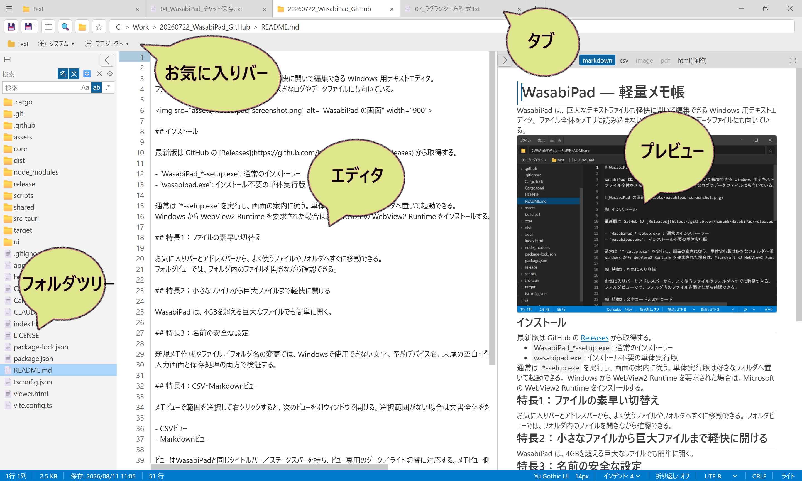

# WasabiPad — 軽量テキストエディタ
ファイルを探す手間を省いたWindows用軽量テキストエディタ。  

  
## インストール
最新版は GitHub の [Releases](https://github.com/hama55/WasabiPad/releases) から取得する。
- `WasabiPad_*-setup.exe`: 通常のインストーラー
- `wasabipad.exe`: インストール不要の単体実行版
通常は `*-setup.exe` を実行し、画面の案内に従う。単体実行版は好きなフォルダへ置いて起動できる。
Windows から WebView2 Runtime を要求された場合は、Microsoft の WebView2 Runtime をインストールする。
  
## 特長1：ファイルの素早い切替え
- お気に入りバー、タブ、フォルダツリーから、よく使うファイルやフォルダへすぐに移動できる。
  
## 特長2：プレビュー画面（markdown etc）
- エディタで編集しながらリアルタイムで確認可能。
- エディタで行選択範囲のみの部分的プレビューも可能
  
## 特長3：巨大ファイルも軽快に開ける
- 4GBを超える巨大なファイルでも簡単に開く。
  
## 他の便利機能
- csvファイルのグラフ作成
- どこからでもファイルをエクスプローラで開ける
- 他アプリからのファイル変更を作業中のエディタ側にマージ
- フォルダツリー内の高速一括検索
- 7z読み取り対応
- markdownファイルへ絵の挿入をクリップボードからペースト
- ダーク or ライトモード切り替え
- ステータスバーから各種設定を高速切り替え
  
## 技術情報
- UI:Tauri
- 内部処理:Rust
  
## 命名の経緯
- 20年使っていたTeraPadに変わるエディタをAIで作ることを志す
- 名前をTeraの部分あえて単位と読み替えて進化させてPetaにしようと考えた
- しかしすでに名前があることが判明
- 命名に悩む。Exaもだめ、あれもこれもだめ
- そういえばサクラエディタのサクラって良いな。
- テキストエディタと関係ないが日本固有だから名前が成立している
- そして私がその時食べていたのは柿の種わさび味
- 決定！
