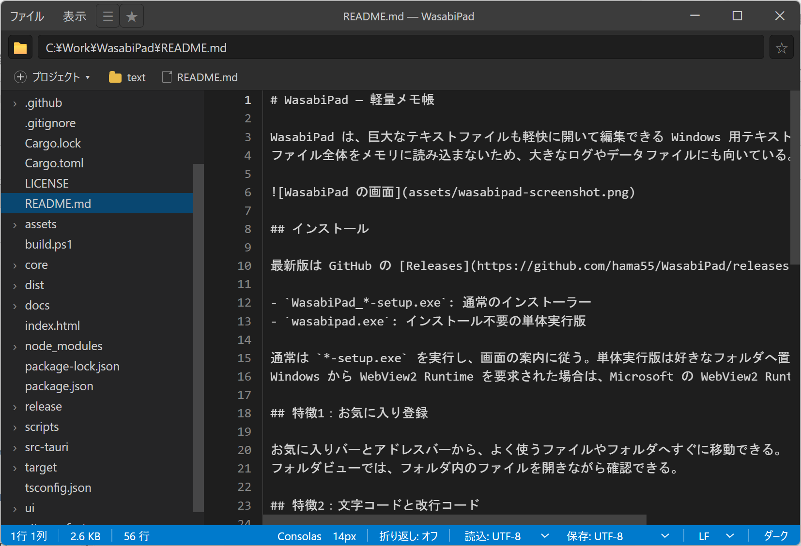

# WasabiPad — 軽量メモ帳

WasabiPad は、巨大なテキストファイルも軽快に開いて編集できる Windows 用テキストエディタ。
ファイル全体をメモリに読み込まないため、大きなログやデータファイルにも向いている。

## インストール

最新版は GitHub の [Releases](https://github.com/hama55/WasabiPad/releases) から取得する。

- `WasabiPad_*-setup.exe`: 通常のインストーラー
- `wasabipad.exe`: インストール不要の単体実行版

通常は `*-setup.exe` を実行し、画面の案内に従う。単体実行版は好きなフォルダへ置いて起動できる。
Windows から WebView2 Runtime を要求された場合は、Microsoft の WebView2 Runtime をインストールする。

## 特長1：ファイルの素早い切替え

お気に入りバーとアドレスバーから、よく使うファイルやフォルダへすぐに移動できる。
フォルダビューでは、フォルダ内のファイルを開きながら確認できる。

## 特長2：小さなファイルから巨大ファイルまで軽快に開ける

WasabiPad は、4GBを超える巨大なファイルでも簡単に開く。

## 特長3：名前の安全な設定

新規メモ作成やファイル／フォルダ名の変更では、Windowsで使用できない文字、予約デバイス名、末尾の空白・ピリオドを受け付けない。
入力画面と保存処理の両方で検証する。

## 特長4：CSV・TSV・Markdownビュー

メモビューで範囲を選択して右クリックすると、次のビューを別ウィンドウで開ける。選択範囲がない場合は文書全体を対象にする。

- CSVビュー
- TSVビュー
- Markdownビュー

ビューはWasabiPadと同じタイトルバー／ステータスバーを持ち、ビュー専用のダーク／ライト切替に対応する。メモビュー側の配色とは独立している。

CSV・TSVビューはメモビューの編集内容を反映する。選択範囲を対象にした場合も、範囲内の行追加・削除などに追従する。

## 特長5：CSV・TSVグラフ

CSV・TSVビューの表を右クリックして「グラフを作成...」を選ぶと、折れ線グラフを作成できる。

- X軸を列から選択
- X軸を反転
- Y軸を複数列から選択
- 凡例クリックで系列を表示／非表示
